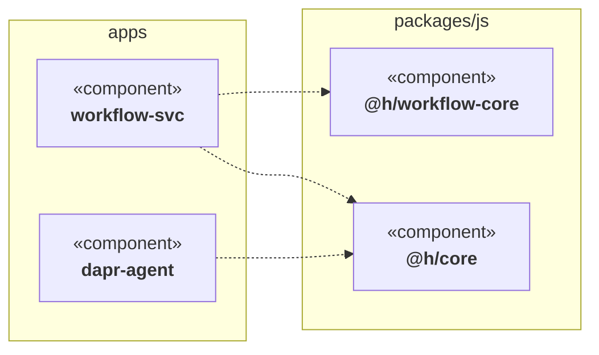

# Component diagram

**Status:** v1 implemented (§8 provided-interfaces and the §9 items remain future work).
**Command:** `vizzy component <repo>` (+ `vizzy diff --type component`, `vizzy serve --type component`)

The spec for vizzy's second diagram type (the first is [class.md](class.md)).
The class diagram answers *"what is the shape of the code?"*; the component diagram answers *"what is the shape of
the application?"* — one box per module, one arrow per dependency, changes
highlighted.

## 1. What this diagram is

A UML component diagram shows the **modular units of a system and the
dependencies between them**. Strict UML defines a component as a replaceable,
encapsulated unit exposing *provided* and *required* interfaces
(ball-and-socket notation); the grouping-of-namespaces view formally belongs
to the UML *package diagram*. vizzy takes the pragmatic, source-derived
reading that has become the de-facto standard for codebase visualization:

> **A component is a build-level module of the repository** — a workspace
> package, an app, a crate, a service — **and an edge is a dependency one
> component has on another**, derived from imports.

Interfaces are not dropped from the model, just deferred: see
[§8 Future: provided interfaces](#8-future-provided-interfaces).

This sits one level of altitude above the class diagram: a reader should be
able to look at it for five seconds and know what the application is made of,
and — in diff mode — which parts of the application a change touched and
whether the change *rewired* anything.

### 1.1 Two lenses, comprehension first

Every diagram type serves two readings, and **comprehension is the primary
one** — a diagram must be worth opening when there is no diff in sight:

- **Comprehension** (`vizzy component <repo>`, no git involved): what is this
  application made of, what depends on what, what lives inside each part.
  Nothing in the model, the renderer, or the page may *require* a base
  revision; git is one source of an annotation, not a precondition.
- **Change** (`vizzy diff --type component`): the same diagram with a change
  annotation layered on top. The diff lens **desaturates unchanged elements to
  context** and saturates changed ones, so the eye lands on the change without
  losing the surrounding shape.

Concretely: `ChangeKind::Unchanged` is the default everywhere, the page renders
identically with or without change data, and drill-down (§5.3) is a
comprehension feature that happens to also work under the diff lens.

## 2. Elements

### 2.1 Component

A **component** is a directory that is a unit of build/distribution.

| Attribute | Meaning | Example (h) |
|---|---|---|
| `name` | Manifest name if declared, else directory name | `@h/workflow-core`, `dapr-agent` |
| `path` | Repo-relative directory | `packages/js/workflow-core` |
| `group` | Nearest meaningful ancestor grouping (see §3.2) | `packages/js`, `apps` |
| `languages` | Languages of parsed files inside it | `typescript` |
| `stats` | File count, class count (from the existing class graph) | `12 files, 9 classes` |
| `change` | `ChangeKind` — same enum the class diagram uses | `Modified` |

### 2.2 Dependency edge

A directed edge `A ──▶ B`: *component A imports from component B*.

| Attribute | Meaning |
|---|---|
| `from`, `to` | Component names |
| `weight` | Number of distinct importing **files** in `A` (not import statements) |
| `change` | `Added` / `Removed` / `Unchanged` (diff mode; see §6) |

Edges are deduplicated: many imports from `A` to `B` produce one edge with a
weight. Self-edges are discarded. External dependencies (npm/PyPI/crates.io)
are excluded by default; `--externals` renders them as a distinct
`«external»` node style, collapsed to one node per package.

### 2.3 Group

A visual container (mermaid `subgraph` / d3 hull) holding sibling components
— not a node in the graph, carries no edges of its own. In h: `apps`,
`packages/js`, `packages/py`, plus top-level singletons (`web`, `cli`).

## 3. Component detection

Detection is **manifest-driven with a directory fallback**, language-neutral,
and requires zero configuration for conventional repos.

### 3.1 Rules, in order

1. **Manifest = component.** Any directory containing a package manifest is a
   component: `package.json`, `pyproject.toml`, `Cargo.toml`, `go.mod`.
   The *innermost* manifest above a source file owns that file.
2. **The repo root is never a component.** A root manifest (workspace
   `package.json`, workspace `Cargo.toml`) declares the workspace; files owned
   directly by the root fall through to rule 3.
3. **Fallback: top-level directory.** A parsed source file under no manifest
   belongs to a component named after its top-level directory (`scripts/…` →
   component `scripts`). Parsed files sitting directly in the repo root are
   collected into a `(root)` component.
4. **Empty components are dropped.** A manifest directory containing no files
   vizzy can parse (no `.py`/`.ts` today) produces no node.

`-I`/`-E` include/exclude globs apply *before* detection, so `-E 'apps/*'`
removes those components entirely.

### 3.2 Naming and grouping

- `name` comes from the manifest (`package.json .name`,
  `pyproject.toml project.name`, `Cargo.toml package.name`); fall back to the
  directory name. Names are unique per graph; on collision, disambiguate with
  the parent directory (`js/core` vs `py/core`).
- `group` is the component's parent path relative to the repo root
  (`apps`, `packages/js`). Components at depth 1 (`web/`) are ungrouped.

### 3.3 Worked example: h

```
apps/*             → 15 components   group "apps"        (package.json each)
packages/js/*      → 11 components   group "packages/js"
packages/py/*      →  2 components   group "packages/py" (pyproject.toml each)
web                →  1 component    ungrouped
cli, scripts, ...  → fallback components if they contain parseable sources
```

Expected edges include `apps/* ──▶ @h/core`, `apps/workflow-svc ──▶
@h/workflow-core`, agents ──▶ `@h/core-dapr`, etc.

## 4. Edge extraction

The parsers gain **import extraction** alongside class extraction (a new
`Import { file, target }` list on `CodeGraph`). An import produces an edge
only when it **resolves to another detected component**:

| Import form | Resolution |
|---|---|
| TS: bare specifier `@h/core`, `@h/core/dist/x` | Match longest prefix against detected components' manifest names (workspace deps) |
| TS: relative `../../packages/js/core/src/x` | Resolve path; owning component = innermost manifest (§3.1) |
| Python: absolute `from agent_core.runner import X` | Match first segment(s) against components' importable package names (from `pyproject.toml` / top-level package dirs) |
| Python: relative `from ..x import y` | Resolve against the file's own path |
| Anything else (stdlib, npm, PyPI) | External — dropped, or one `«external»` node per package under `--externals` |

Resolution intentionally reuses the spirit of the class diagram's
`resolve.rs`: best-effort, name-based, no build-system evaluation. TS path
aliases (`tsconfig.json paths`) are out of scope for v1 and listed in §9.

## 5. Rendering

### 5.1 Mermaid

Mermaid has no native UML component-diagram syntax, so vizzy renders a
`flowchart` styled to read as one — the same pragmatic choice the class
renderer makes with Mermaid 11 quirks. Conventions:

- Node label: `«component»<br/><b>name</b>` (guillemets keep the UML idiom).
- Groups render as `subgraph` blocks (analogous to `--group` namespaces in
  the class diagram; here grouping is **on by default**, `--no-group` flattens).
- Dependency edges are dashed arrows `-.->`, the flowchart cousin of UML's
  dashed dependency `..>`. Weight ≥ 2 renders as an edge label (`-. 7 .->`)
  under `--weights`.
- Direction defaults to `LR` (dependency graphs read better left→right);
  `--direction` overrides, matching the class command.
- Diff styling reuses the class diagram's exact palette and glyphs:
  added = green `✚`, removed = red `✖`, modified = yellow `✱`, via `classDef`
  emitted **after** class attachments (same Mermaid 11 ordering quirk).

Sketch:



### 5.2 Interactive HTML (d3)

Same self-contained page as the class diagram (inlined d3, zoom, pan, drag,
fit-to-view, filter box, position-preserving live reload under `vizzy serve`),
with component-specific behavior:

- Nodes are compact boxes: name + `«component»` tag + UML tabs glyph + a small
  stats line (`9 classes · ts`).
- **Group boxes are first-class objects, not decoration**: the box around
  `apps` or `packages/js` is labelled, and dragging it moves every component
  inside it, so a reader can pull a whole subsystem aside.
- Layout is a force pass seeded by per-group gravity, then a two-level
  rectangular relaxation: components separate within their group, then groups
  separate as whole blocks. The relaxation shares its geometry with the group
  box renderer, so the gap the layout leaves is the gap you see, and no box
  ever overlaps another.
- Edge thickness scales with `weight` (capped) and arrowheads are deliberately
  small — at 50+ edges, default-sized heads dominate the picture.

### 5.3 Drill-down: the class diagram inside a component

The component view answers "what is this made of?" only if you can open a
component up. Each box with classes carries a `+` toggle; opening it explodes
the component into **a real UML class diagram of its own classes** — boxes with
stereotype, field and method compartments, data types on every member and
signature, and the relations between them. A header button opens or closes
every component at once.

Nested layout is packed, not force-directed: most classes in a package have no
relations at all, so repulsion just fills the box with whitespace. Boxes are
ordered by connectivity (related classes adjacent, isolated ones trailing) and
packed into rows sized for a landscape block. Expanding re-runs the outer
relaxation, so a growing box pushes its neighbours aside, and the viewport
frames what you opened.

**Built once, then shown or hidden.** Every component's class diagram is laid
out and its DOM created at load; toggling only flips visibility and resizes the
box. Nothing is rebuilt, so a 34-class component opens in single-digit
milliseconds however many times you toggle it, and opening all 25 at once on h
takes ~70ms.

The payload carries `classes[]` (each tagged with its owning `component`) and
`classRelations[]`, both in the same shape the class diagram uses.
`--no-classes` omits them for a leaner page.

Relations that cross a component boundary are not drawn inside a box — they
belong at the component level, where the dependency edge already says it.

## 6. Diff semantics

`vizzy diff --type component` reuses the whole git pipeline (changed files
via `git diff --name-status -M -z`, base contents via `git show`) but —
unlike the class diff, which only parses touched files — **builds the full
component graph for both revisions**, since an edge's existence depends on
files the diff didn't touch. Cost is acceptable: parsing is the hot path and
already handles whole-repo scale.

| Element | Added | Removed | Modified |
|---|---|---|---|
| Component | didn't exist at base | gone at head | any owned file added/removed/changed |
| Edge | new dependency between surviving components | dependency dropped | — (weight change alone is *not* a diff signal) |

A *rewiring* (added/removed edge) is the headline signal of this diagram and
must be visually louder than component-level churn: changed edges render
solid + colored + thicker, unchanged edges stay faint.

Under the diff lens the whole palette shifts: unchanged components, edges, and
class chips drop to a neutral grey (`--context-*`), and only changed elements
keep saturated color (green added / red removed / amber modified) plus their
✚ ✖ ✱ glyph. Without a diff the same elements render in the normal palette —
contrast is applied *because* there is something to contrast against.
Classes inside a component carry their own change status, so opening a modified
component shows which classes drove the change.

Unchanged components with no changed edges render as context (same rule as
unchanged classes in touched files today), but components entirely unrelated
to the change may be collapsed per-group under `--focus` to keep large diffs
readable.

## 7. CLI surface

```sh
vizzy component <repo> [-o out.mmd|out.html] [flags]     # full graph
vizzy diff <repo> --type component [--base ... --head ...]
vizzy serve <repo> --type component [--diff]
```

Shared flags keep their existing meaning: `-o`, `-f/--format mermaid|html`,
`--title`, `-I/-E`, `--direction`, `--externals`. New: `--no-group`,
`--weights`, `--no-classes` (html payload), `--focus` (diff only).
`--type class` remains the default for `diff`/`serve`, so existing invocations
are untouched.

## 8. Future: provided interfaces

The UML-strict layer, deferred from v1 but the model leaves room for it: a
component may declare **provided interfaces** — in h, the hexagonal
`src/domain/ports/*` interfaces are exactly this — rendered lollipop-style,
with edges landing on the interface instead of the component when the import
targets a port. Requires interface-level resolution, so it builds on the
class graph vizzy already extracts.

## 9. Out of scope (v1)

- TS `tsconfig.json` path aliases and Python namespace packages.
- Runtime/infra edges (Dapr pub/sub, HTTP calls between h services) — imports
  only. A future `--infra` source could read declared bindings, but that is a
  different truth source and must not silently mix with import edges.
- Association multiplicity, and the aggregation/composition diamonds — the
  relation model, and the decision on ownership notation, live in the class
  diagram's spec ([class.md §5.4](class.md#54-decision-aggregation-and-composition-diamonds)).
- Relations crossing a component boundary drawn between the class boxes
  themselves (they render as component-level dependency edges instead).
- Rust/Go **parsing** (detection already recognizes their manifests, so a
  `Cargo.toml` crate with only `.rs` files simply yields no node until a
  parser exists).

## 9.1 Implementation notes

The two HTML views are built from one shared core (`assets/viz-core.css` and
`assets/viz-core.js`, inlined into every page): palette and change-color rules,
box/edge geometry, the arrowhead marker, zoom/pan/fit with a viewport that
survives reloads, the filter box, and the header readout. A template owns only
what is specific to its diagram — what a node looks like and how it is laid
out. Add a third diagram type by writing a template, not by copying a page.

The same rule holds in the core: `export::class_json` and `export::change_str`
are shared by the class and component exports, so both describe a class
identically, and the component diff reuses `diff::diff_graphs` rather than
implementing a second class-comparison.

## 10. Acceptance, on h

1. `vizzy component ~/code/h -o h-components.html` renders ~29 components in
   4 groups; `@h/core` is visibly the most-depended-on node; the page opens
   settled, zooms, pans, filters.
2. `vizzy component ~/code/h -o h-components.mmd` produces valid Mermaid 11
   (`mmdc` renders it without error).
3. Adding `import { x } from "@h/git-core"` to an app that didn't use it, then
   `vizzy diff ~/code/h --type component`, shows exactly one green edge (and
   the app marked modified) — no other rewiring noise.
4. Whole-repo generation stays well under a second in the Rust core, matching
   the class diagram's budget.
