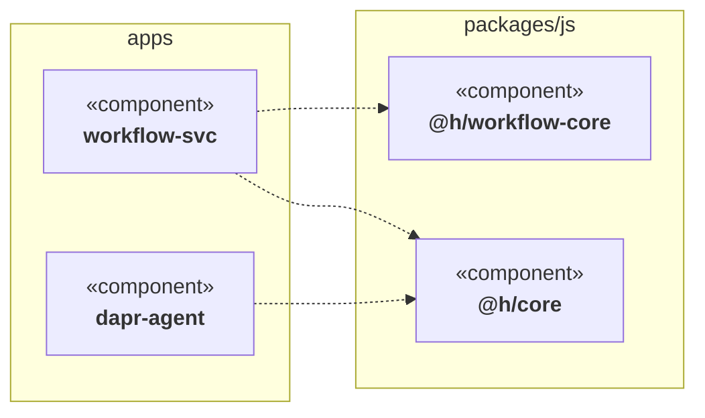

# Component diagram

**Status:** v1 implemented (§8 provided-interfaces and the §9 items remain future work).
**Command:** `vizzle component <repo>` (+ `vizzle diff --type component`, `vizzle serve --type component`)

The spec for vizzle's second diagram type (the first is [class.md](class.md)).
The class diagram answers *"what is the shape of the code?"*; the component diagram answers *"what is the shape of
the application?"* — one box per module, one arrow per dependency, changes
highlighted.

## 1. What this diagram is

A UML component diagram shows the **modular units of a system and the
dependencies between them**. Strict UML defines a component as a replaceable,
encapsulated unit exposing *provided* and *required* interfaces
(ball-and-socket notation); the grouping-of-namespaces view formally belongs
to the UML *package diagram*. vizzle takes the pragmatic, source-derived
reading that has become the de-facto standard for codebase visualization:

> **A component is a build-level module of the repository** — a workspace
> package, an app, a crate, a service — **and an edge is a dependency one
> component has on another**, derived from imports.

Interfaces are not dropped from the model, just deferred: see
[§8 Future: provided interfaces](#8-future-provided-interfaces).

This sits one level of altitude above the class diagram: a reader should be
able to look at it for five seconds and know what the application is made of,
and — in diff mode — which parts of the application a change touched and
whether the change *rewired* anything.

### 1.1 Two lenses, comprehension first

Every diagram type serves two readings, and **comprehension is the primary
one** — a diagram must be worth opening when there is no diff in sight:

- **Comprehension** (`vizzle component <repo>`, no git involved): what is this
  application made of, what depends on what, what lives inside each part.
  Nothing in the model, the renderer, or the page may *require* a base
  revision; git is one source of an annotation, not a precondition.
- **Change** (`vizzle diff --type component`): the same diagram with a change
  annotation layered on top. The diff lens **desaturates unchanged elements to
  context** and saturates changed ones, so the eye lands on the change without
  losing the surrounding shape.

Concretely: `ChangeKind::Unchanged` is the default everywhere, the page renders
identically with or without change data, and drill-down (§5.3) is a
comprehension feature that happens to also work under the diff lens.

## 2. Elements

### 2.1 Component

A **component** is a directory that is a unit of build/distribution.

| Attribute | Meaning | Example (h) |
|---|---|---|
| `name` | Manifest name if declared, else directory name | `@h/workflow-core`, `dapr-agent` |
| `path` | Repo-relative directory | `packages/js/workflow-core` |
| `group` | Nearest meaningful ancestor grouping (see §3.2) | `packages/js`, `apps` |
| `languages` | Languages of parsed files inside it | `typescript` |
| `stats` | File count, class count (from the existing class graph) | `12 files, 9 classes` |
| `change` | `ChangeKind` — same enum the class diagram uses | `Modified` |

### 2.2 Dependency edge

A directed edge `A ──▶ B`: *component A imports from component B*.

| Attribute | Meaning |
|---|---|
| `from`, `to` | Component names |
| `weight` | Number of distinct importing **files** in `A` (not import statements) |
| `change` | `Added` / `Removed` / `Unchanged` (diff mode; see §6) |

Edges are deduplicated: many imports from `A` to `B` produce one edge with a
weight. Self-edges are discarded. External dependencies (npm/PyPI/crates.io)
are excluded by default; `--externals` renders them as a distinct
`«external»` node style, collapsed to one node per package.

### 2.3 Group

A visual container (mermaid `subgraph` / d3 hull) holding sibling components
— not a node in the graph, carries no edges of its own. In h: `apps`,
`packages/js`, `packages/py`, plus top-level singletons (`web`, `cli`).

## 3. Component detection

Detection is **manifest-driven with a directory fallback**, language-neutral,
and requires zero configuration for conventional repos.

### 3.1 Rules, in order

1. **Manifest = component.** Any directory containing a package manifest is a
   component: `package.json`, `pyproject.toml`, `Cargo.toml`, `go.mod`.
   The *innermost* manifest above a source file owns that file.
2. **The repo root is never a component.** A root manifest (workspace
   `package.json`, workspace `Cargo.toml`) declares the workspace; files owned
   directly by the root fall through to rule 3.
3. **Fallback: top-level directory.** A parsed source file under no manifest
   belongs to a component named after its top-level directory (`scripts/…` →
   component `scripts`). Parsed files sitting directly in the repo root are
   collected into a `(root)` component.
4. **Empty components are dropped.** A manifest directory containing no files
   vizzle can parse (no `.py`/`.ts` today) produces no node.

`-I`/`-E` include/exclude globs apply *before* detection, so `-E 'apps/*'`
removes those components entirely.

### 3.4 Splitting a package into its subsystems (`--split DIR`)

Rule 1 draws a manifest as one box. For a workspace of many small packages
that is the architecture. For a service that is **one manifest but many
subsystems** — a Python package with `orchestrator/`, `persistence/`, `api/`
under `src/<pkg>/` — it is the opposite: every change lands in the same box,
and the diagram can only ever say "the service changed".

`--split DIR` (repeatable) refines detection below rule 1: each direct child
directory of DIR that owns parsed files is a component of its own (`DIR/<child>`,
named `<child>`, grouped under DIR), and files sitting directly in DIR form a
component at DIR itself. The enclosing manifest component keeps whatever it
owned outside DIR. Children spell their Python imports from the enclosing
component's import root (its `src/` for a src layout), which is what makes
`pkg.persistence.models` resolve to `persistence` (§4).

Why a flag and not a rule: where the subsystems live is the reader's
judgement, exactly like the scope. A rule that split every single-package
manifest would redraw every Python repository's diagram overnight, and would
guess wrong for packages whose first directory level is not architecture.
The split rides the legend and the trailer (`split <dir>`) like a selection,
because both are the reader's statement of what counts as architecture.

Measured on the kikimora harness (2026-09-22, PR #17682): without a split, 5
components, one of them the whole service, marked modified. With
`--split harness/kikimora/src/kikimora`: 39 components and 241 dependencies;
the PR modifies `orchestrator` and `persistence` and rewires nothing.

The root (`--split .`) is refused: the root's own top-level directories are
already components under rule 3.

### 3.2 Naming and grouping

- `name` comes from the manifest (`package.json .name`,
  `pyproject.toml project.name`, `Cargo.toml package.name`); fall back to the
  directory name. Names are unique per graph; on collision, disambiguate with
  the parent directory (`js/core` vs `py/core`).
- `group` is the component's parent path relative to the repo root
  (`apps`, `packages/js`). Components at depth 1 (`web/`) are ungrouped.

### 3.3 Worked example: h

```
apps/*             → 15 components   group "apps"        (package.json each)
packages/js/*      → 11 components   group "packages/js"
packages/py/*      →  2 components   group "packages/py" (pyproject.toml each)
web                →  1 component    ungrouped
cli, scripts, ...  → fallback components if they contain parseable sources
```

Expected edges include `apps/* ──▶ @h/core`, `apps/workflow-svc ──▶
@h/workflow-core`, agents ──▶ `@h/core-dapr`, etc.

## 4. Edge extraction

The parsers gain **import extraction** alongside class extraction (a new
`Import { file, target }` list on `CodeGraph`). An import produces an edge
only when it **resolves to another detected component**:

| Import form | Resolution |
|---|---|
| TS: bare specifier `@h/core`, `@h/core/dist/x` | Match longest prefix against detected components' manifest names (workspace deps) |
| TS: relative `../../packages/js/core/src/x` | Resolve path; owning component = innermost manifest (§3.1) |
| Python: absolute `from agent_core.runner import X` | Match the **longest dotted prefix** of the specifier against the module paths components own (every prefix of every file's module path, spelled from its import root). A prefix two components share resolves to nothing rather than to either; a prefix nobody owns is external |
| Python: relative `from ..x import y` | Resolve against the file's own path |
| Anything else (stdlib, npm, PyPI) | External — dropped, or one `«external»` node per package under `--externals` |

Resolution intentionally reuses the spirit of the class diagram's
`resolve.rs`: best-effort, name-based, no build-system evaluation. TS path
aliases (`tsconfig.json paths`) are out of scope for v1 and listed in §9.

## 5. Rendering

### 5.1 Mermaid

Mermaid has no native UML component-diagram syntax, so vizzle renders a
`flowchart` styled to read as one — the same pragmatic choice the class
renderer makes with Mermaid 11 quirks. Conventions:

- Node label: `«component»<br/><b>name</b>` (guillemets keep the UML idiom).
- Groups render as `subgraph` blocks (analogous to `--group` namespaces in
  the class diagram; here grouping is **on by default**, `--no-group` flattens).
- Dependency edges are dashed arrows `-.->`, the flowchart cousin of UML's
  dashed dependency `..>`. Weight ≥ 2 renders as an edge label (`-. 7 .->`)
  under `--weights`.
- Direction defaults to `LR` (dependency graphs read better left→right);
  `--direction` overrides, matching the class command.
- Diff styling reuses the class diagram's exact palette and glyphs:
  added = green `✚`, removed = red `✖`, modified = yellow `✱`, via `classDef`
  emitted **after** class attachments (same Mermaid 11 ordering quirk).

Sketch:



### 5.2 Interactive HTML (d3)

Same self-contained page as the class diagram (inlined d3, zoom, pan, drag,
fit-to-view, filter box, position-preserving live reload under `vizzle serve`),
with component-specific behavior:

- Nodes are compact boxes: name + `«component»` tag + UML tabs glyph + a small
  stats line (`9 classes · ts`).
- **Group boxes are first-class objects, not decoration**: the box around
  `apps` or `packages/js` is labelled, and dragging it moves every component
  inside it, so a reader can pull a whole subsystem aside.
- Layout is a force pass seeded by per-group gravity, then a two-level
  rectangular relaxation: components separate within their group, then groups
  separate as whole blocks. The relaxation shares its geometry with the group
  box renderer, so the gap the layout leaves is the gap you see, and no box
  ever overlaps another.
- Edge thickness scales with `weight` (capped) and arrowheads are deliberately
  small — at 50+ edges, default-sized heads dominate the picture.

### 5.3 Drill-down: the class diagram inside a component

The component view answers "what is this made of?" only if you can open a
component up. Each box with classes carries a `+` toggle; opening it explodes
the component into **a real UML class diagram of its own classes** — boxes with
stereotype, field and method compartments, data types on every member and
signature, and the relations between them. A header button opens or closes
every component at once.

Nested layout is packed, not force-directed: most classes in a package have no
relations at all, so repulsion just fills the box with whitespace. Boxes are
ordered by connectivity (related classes adjacent, isolated ones trailing) and
packed into rows sized for a landscape block. Expanding re-runs the outer
relaxation, so a growing box pushes its neighbours aside, and the viewport
frames what you opened.

**Built once, then shown or hidden.** Every component's class diagram is laid
out and its DOM created at load; toggling only flips visibility and resizes the
box. Nothing is rebuilt, so a 34-class component opens in single-digit
milliseconds however many times you toggle it, and opening all 25 at once on h
takes ~70ms.

The payload carries `classes[]` (each tagged with its owning `component`) and
`classRelations[]`, both in the same shape the class diagram uses.
`--no-classes` omits them for a leaner page.

Relations that cross a component boundary are not drawn inside a box — they
belong at the component level, where the dependency edge already says it.

**One glob, one meaning — including the path it is matched against.** Sharing a
matcher is not enough. `component <path>` is a walk rooted at `<path>`, so it
sees `tests/fixtures/...`; a component diff cannot be rooted there, because an
edge's existence depends on files the change never touched, so it collects the
whole repository and sees `<path>/tests/fixtures/...`. A glob is therefore
matched against **both** the repo-relative path and the path relative to the
scope argument. Without that, `-E 'tests/fixtures/**'` filters on `component`
and silently does nothing on `diff`, which is the inconsistency this
vocabulary exists to remove.

## 6. Diff semantics

`vizzle diff --type component` reuses the whole git pipeline (changed files
via `git diff --name-status -M -z`, base contents via `git show`) but —
unlike the class diff, which only parses touched files — **builds the full
component graph for both revisions**, since an edge's existence depends on
files the diff didn't touch. Cost is acceptable: parsing is the hot path and
already handles whole-repo scale.

| Element | Added | Removed | Modified |
|---|---|---|---|
| Component | didn't exist at base | gone at head | any owned file added/removed/changed |
| Edge | new dependency between surviving components | dependency dropped | — (weight change alone is *not* a diff signal) |

A *rewiring* (added/removed edge) is the headline signal of this diagram and
must be visually louder than component-level churn: changed edges render
solid + colored + thicker, unchanged edges stay faint.

Under the diff lens the whole palette shifts: unchanged components, edges, and
class chips drop to a neutral grey (`--context-*`), and only changed elements
keep saturated color (green added / red removed / amber modified) plus their
✚ ✖ ✱ glyph. Without a diff the same elements render in the normal palette —
contrast is applied *because* there is something to contrast against.
Classes inside a component carry their own change status, so opening a modified
component shows which classes drove the change.

Unchanged components with no changed edges render as context (same rule as
unchanged classes in touched files today), but components entirely unrelated
to the change may be collapsed per-group under `--focus` to keep large diffs
readable.

**The verdict is data, not drawing.** A consumer that acts on a diff (a CI
step deciding whether to post it, and where) must not learn "did anything
change" by grepping the mermaid for `diffAdded` or a glyph: those are
palette and rendering choices, free to change between releases. The JSON
export carries `stats.changes = {added, removed, modified}` tallied over
components *and* edges (so a pure rewiring still counts), and `stats.diff` is
its boolean. `vizzle diff --stats FILE` writes the same verdict beside the
diagram, plus the rendered size and, for mermaid, the ceiling it is measured
against:

```json
{"type": "component", "format": "mermaid", "changed": true,
 "changes": {"added": 1, "removed": 0, "modified": 1},
 "chars": 1333, "mermaidLimit": 50000, "oversized": false}
```

Shipped in 0.6.0. A consumer that reads the diagram text for any of this is
coupled to the renderer and will break silently when it changes.

**The base is the fork point, not the base branch's tip.** A pull request's
base is a moving branch. `vizzle diff --base main` resolves `main` to
`git merge-base main <head>` before either revision is collected, for both
diagram types and for `serve --diff`, so commits the base gained since the
branch forked are drawn as unchanged context, not as this change. For a linear
history the fork point *is* the base, so `--base HEAD~20` is unaffected. The
title keeps the reader's spelling (`changes vs main`). Measured on PR #17682
against a `main` that had moved 58 commits: 11 components read as modified
against the tip, 3 against the fork point — and only the 3 were the PR's.

### 6.1 Path-based scoping and boundary detection

`vizzle diff --type component <path>` accepts a path but **must produce a diagram of
`<path>`, not the repository**. Unlike the class diff, scope filtering cannot
happen at file-collection time (edge existence depends on the full graph), so:

**Scoping strategy:** Collect both revisions in full, diff them in full, filter at the
end. Retain every component whose files live under `<path>`, plus every component
outside `<path>` that shares a dependency edge (in either direction) with an
in-scope component. This boundary set shows structural dependencies at the scope
edge — a critical signal when code is organized into layers or feature areas
where crossing boundaries indicates rewiring.

**Example:** The repository's full graph has 31 components. Scoping to
`packages/js/engine-core` (1 in-scope component) keeps that component plus 5
out-of-scope neighbours that import from or export to it, totalling 6
components and 5 edges. Removing the scope filter brings back the full 31.

**Visual distinction:** Out-of-scope boundary neighbours are marked with
`«boundary»` (distinct from `«external»`, which remains third-party packages
only) and render in a dashed-border style to signal "this is part of a
cross-boundary edge". The legend reflects the scope when active.

**Boundary nodes as pure context:** A boundary node renders as context regardless
of whether it changed outside the scope. It receives no change glyph (✚ ✖ ✱),
no change fill/stroke class (diffAdded etc.), and no change stereotype label.
The rule: if `is_boundary`, apply only the boundary style; change annotations from
outside the scope are irrelevant to a reviewer focused on `<path>`.

**Non-root path refusal:** If `<path>` is inside a component root but not at one
(i.e. no manifest file sits directly in `<path>`), the CLI exits non-zero with an
error naming the nearest enclosing component root:
```
Error: no component is rooted at packages/vizzle-cli/src
The nearest enclosing component is packages/vizzle-cli
```

Measured on h @ 17011fa: `packages/js/engine-core` scoped component diff
reports 6 components, 5 dependencies (vs 31/62 full-repo or 1/0 if naively
filtered before build — the trap).

### 6.2 Selection (`-I` / `-E` / `-l`) composes before scoping

A component root is "a directory with a manifest in it" (§3.1), so anything
carrying a manifest is drawn as architecture — including test fixtures that are
themselves small packages, example projects and scaffolding templates. The
selection flags are how a reader says "that one is not architecture", and
they mean the same thing on `diff` as on `component`: **`-I`/`-E` are globs
over repo-relative source paths, `-l` restricts languages, and a component
left owning no files is never created.** One matcher in the core
(`walk::Selector`) serves every command, so a glob cannot mean two things.

Three rules follow, each decided rather than defaulted:

**Selection applies to BOTH revisions, before either graph is built.** A
fixture excluded at head but present at base would render as *removed*; the
filter would be manufacturing the very change it was asked to hide. So the
selector runs on each revision's file set first, and only then are the two
graphs built and compared. Nothing can appear added or removed because of a
filter — a filtered component is absent on both sides.

**Selection runs BEFORE scope; scope runs AFTER diff.** These are two
different questions with opposite answers, and §6.1's trap is not a
contradiction. Scope asks *which part of the graph to show* — it needs the full
graph on both sides to find the boundary at all, so it must come last.
Selection asks *what is not architecture* — a component the reader said not to
show must not come back as a `«boundary»` neighbour, so it has to be gone
before the boundary is computed. The consequence, stated plainly: **an
excluded component is dropped even when an in-scope component depends on it,
and the edge into it goes with it.** That edge is real structure and it is no
longer drawn; the legend says so (below). The alternative — keeping it dashed
as a boundary — would be the tool overriding the reader.

**Exclusion is total, change markers included.** A pull request that touches
only excluded paths renders as *no structural change*. The diagram claims to
describe the selected architecture; a marker for a component it does not draw
would be a marker pointing at nothing. This is what a per-PR consumer wants
from `-E '**/tests/fixtures/**'`: a fixture-only change should not light the
"shape changed" signal (`--stats` reports `changed: false`). It is arguably a
lie about the *repository*; it is the truth about the *selection*, which is
why the selection is always stated.

**The legend states the selection.** Every renderer carries the active
selection so a reader knows what the diagram is not claiming: the HTML legend
gains a `selection: exclude …` entry (and un-hides for it), the JSON export
carries `stats.selection`, and Mermaid — which has no legend — appends a
`%% vizzle: selection: …` trailer beside the component count. The wording is
`include <glob>` / `exclude <glob>` / `lang <name>` rather than the CLI flag
spellings, because the core does not know how the CLI spells `-E`.

Selecting everything away is an error, not an empty diagram: on the class
diff, `-E` that removes every changed file exits with
`no changed files match the include/exclude/lang selection`, since the caller
already established there WERE changed files and the reader should hear that
the selection ate them.

Measured on h @ 17011fa, `--base HEAD~1`: the full component diff is 31
components / 62 dependencies; `-E 'apps/**'` gives 16 / 17. Scoped to
`packages/js/engine-core` it is 6 / 5 (§6.1); adding `-E 'apps/**'` drops the
`workflow-svc` boundary node and its edge, giving 5 / 4 with the trailer
`%% vizzle: selection: exclude apps/**`.

### 6.3 Focus (`--focus`)

A split service has tens of components and hundreds of edges; drawn whole,
a diff is a hairball in which the two changed boxes are hard to find.
`--focus` keeps what a reader of the change needs and drops the rest:

- every changed component (added, removed or modified);
- every added or removed edge, with both its endpoints;
- every unchanged component an existing edge ties to a changed one — the
  neighbours, because a change to `persistence` matters to whoever imports it,
  and an edge with one end missing tells the reader nothing;
- the edges among those.

Everything else is left out and **counted**: the trailer says
`focus: N unchanged component(s) not drawn`, and `stats.omitted` / the
`--stats` sidecar carry N, so a consumer can say so in prose. Boundary nodes
carry no change of their own and survive only as neighbours. When nothing
changed, focus draws nothing and counts everything; `--stats` already says
`changed: false`.

Focus runs last — after selection, diff and scope — because it is a view
choice over a graph that has already been built in full.

Measured on PR #17682 with the split above: whole graph 39 components / 241
edges, 27,700 chars; focused 26 / 48, 7,400 chars, 13 not drawn. Still busy,
because `orchestrator` is a hub with twenty neighbours; a tighter mode
(changed components and changed edges only) is the next step if reviewers
find neighbours noise rather than signal.

## 7. CLI surface

```sh
vizzle component <repo> [-o out.mmd|out.html] [--split DIR] [flags]     # full graph
vizzle diff <repo> --type component [--base ... --head ...] [--split DIR] [--focus] [--stats verdict.json]
vizzle serve <repo> --type component [--diff]
```

Shared flags keep their existing meaning: `-o`, `-f/--format mermaid|html`,
`--title`, `-I/-E/-l` (on `diff` and `serve --diff` they apply to both
revisions, §6.2), `--direction`, `--externals`. New: `--no-group`,
`--weights`, `--focus` (diff only). `--classes/--no-classes` controls whether
class detail (drill-down in the HTML view) is embedded; component diff defaults
to `--no-classes` (class bodies are heavy; a reviewer asking "what rewired"
typically does not expand them). `--type class` remains the default for `diff`/`serve`,
so existing invocations are untouched. `--stats FILE` (diff only, §6) writes the
change verdict and rendered size as JSON for tooling. `--split DIR` (§3.4, on
`component` and `diff`; repeatable; spelled relative to the walk root, or on
`diff` also relative to the scope like `-E`) and `--focus` (§6.3, `diff` only)
are the two knobs for a single-manifest service. `serve` does not take
`--split` yet.

## 8. Future: provided interfaces

The UML-strict layer, deferred from v1 but the model leaves room for it: a
component may declare **provided interfaces** — in h, the hexagonal
`src/domain/ports/*` interfaces are exactly this — rendered lollipop-style,
with edges landing on the interface instead of the component when the import
targets a port. Requires interface-level resolution, so it builds on the
class graph vizzle already extracts.

## 9. Out of scope (v1)

- TS `tsconfig.json` path aliases and Python namespace packages.
- Runtime/infra edges (Dapr pub/sub, HTTP calls between h services) — imports
  only. A future `--infra` source could read declared bindings, but that is a
  different truth source and must not silently mix with import edges.
- Association multiplicity, and the aggregation/composition diamonds — the
  relation model, and the decision on ownership notation, live in the class
  diagram's spec ([class.md §5.4](class.md#54-decision-aggregation-and-composition-diamonds)).
- Relations crossing a component boundary drawn between the class boxes
  themselves (they render as component-level dependency edges instead).
- Rust/Go **parsing** (detection already recognizes their manifests, so a
  `Cargo.toml` crate with only `.rs` files simply yields no node until a
  parser exists).

## 9.1 Implementation notes

The two HTML views are built from one shared core (`assets/viz-core.css` and
`assets/viz-core.js`, inlined into every page): palette and change-color rules,
box/edge geometry, the arrowhead marker, zoom/pan/fit with a viewport that
survives reloads, the filter box, and the header readout. A template owns only
what is specific to its diagram — what a node looks like and how it is laid
out. Add a third diagram type by writing a template, not by copying a page.

The same rule holds in the core: `export::class_json` and `export::change_str`
are shared by the class and component exports, so both describe a class
identically, and the component diff reuses `diff::diff_graphs` rather than
implementing a second class-comparison.

## 10. Acceptance, on h

1. `vizzle component ~/code/h -o h-components.html` renders ~29 components in
   4 groups; `@h/core` is visibly the most-depended-on node; the page opens
   settled, zooms, pans, filters.
2. `vizzle component ~/code/h -o h-components.mmd` produces valid Mermaid 11
   (`mmdc` renders it without error).
3. Adding `import { x } from "@h/git-core"` to an app that didn't use it, then
   `vizzle diff ~/code/h --type component`, shows exactly one green edge (and
   the app marked modified) — no other rewiring noise.
4. Whole-repo generation stays well under a second in the Rust core, matching
   the class diagram's budget.
