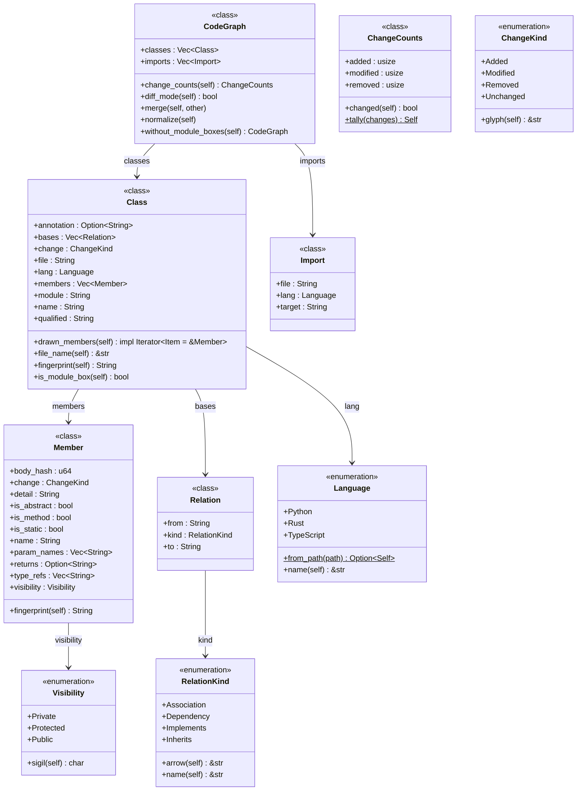

# The core model

`crates/vizzle-core/src/model.rs` defines the language-neutral shape every
parser produces and every renderer consumes. A `CodeGraph` is one revision's
worth of code: the `Class` boxes it contains and the `Import` edges between
files that make up the component view. A `Class` is a named type (or a
`<<module>>` box), holding the `Member` rows — fields, methods, enum variants —
that a reader sees inside it. A `Relation` is one edge between two classes,
carrying a `RelationKind` that says whether it is inheritance, implementation,
association or a dependency. `Import` records a file's import of another,
before classes are grouped into components.

Enumerations such as `Language`, `Visibility`, `ChangeKind` and `RelationKind`
are part of the same model: their variants become members, which is how a
constructed diagram stays honest about the values a type can take. `ChangeCounts`
summarises how many elements of a diff carry each change kind.

<!-- gen:c4-code {
  "classes": [
    {"id": "CodeGraph", "kind": "class", "file": "crates/vizzle-core/src/model.rs", "symbol": "CodeGraph"},
    {"id": "Class", "kind": "class", "file": "crates/vizzle-core/src/model.rs", "symbol": "Class"},
    {"id": "Member", "kind": "class", "file": "crates/vizzle-core/src/model.rs", "symbol": "Member"},
    {"id": "Relation", "kind": "class", "file": "crates/vizzle-core/src/model.rs", "symbol": "Relation"},
    {"id": "Import", "kind": "class", "file": "crates/vizzle-core/src/model.rs", "symbol": "Import"},
    {"id": "ChangeCounts", "kind": "class", "file": "crates/vizzle-core/src/model.rs", "symbol": "ChangeCounts"},
    {"id": "Language", "kind": "enumeration", "file": "crates/vizzle-core/src/model.rs", "symbol": "Language"},
    {"id": "Visibility", "kind": "enumeration", "file": "crates/vizzle-core/src/model.rs", "symbol": "Visibility"},
    {"id": "ChangeKind", "kind": "enumeration", "file": "crates/vizzle-core/src/model.rs", "symbol": "ChangeKind"},
    {"id": "RelationKind", "kind": "enumeration", "file": "crates/vizzle-core/src/model.rs", "symbol": "RelationKind"}
  ],
  "relations": [
    ["CodeGraph", "Class", null, "classes"],
    ["CodeGraph", "Import", null, "imports"],
    ["Class", "Member", null, "members"],
    ["Class", "Relation", null, "bases"],
    ["Class", "Language", null, "lang"],
    ["Member", "Visibility", null, "visibility"],
    ["Relation", "RelationKind", null, "kind"]
  ]
} -->

